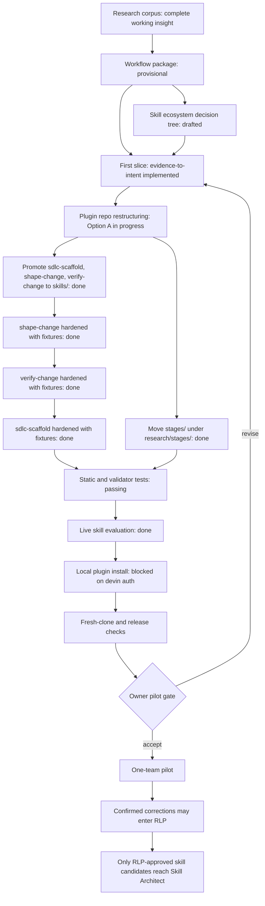

# Evidence-Led Delivery roadmap

Updated: 2026-09-22
Skill ecosystem decision tree: drafted
Repository state: initial repository with no commits; all files are untracked
Current stage: toolkit slices S6–S9 accepted, S10 implemented pending owner review; Slice 2 install blocked on `devin auth login`; run-09 (`skill-architect` intent) stopped per contract with a gap report; pilot readiness not established

## Decisions needed first

1. **Baseline commit:** no commit is currently authorized. A fresh session can read files, but there is no Git revision for changed-surface review, fresh-clone testing, or release provenance. Ask the owner whether to create the initial baseline commit before claiming pilot readiness. Now blocking: Slice 3 and `source_revision` provenance in generated specs.
2. **Pilot target:** resolved — dogfood on this repository first, then demo on `../skill-architect` (owner direction 2026-09-13). Draft contract at `decisions/0004-dogfood-pilot-contract.md` awaits owner review, including which change supplies the dogfood slice.
3. **Names:** confirmed 2026-09-13 — plugin `evidence-led-delivery`, first skill `evidence-to-intent`.
4. **Distribution boundary:** resolved 2026-09-13 — private Workflow Package Builder and ICM-converted Scuba material may be adapted into public artifacts.
5. **Host auth:** `devin plugins install .` requires `devin auth login`; owner will run it, then Slice 2 resumes.
6. **Spec review:** `.devin/eval/20260913-normal/output/run-01/intent-specification.md` awaits owner accept/revise/reject, including confirmation of the five derived acceptance cues in the run's `session-note.md`.
7. **S10 receipt review:** `skills/evaluate-outcome` implemented and tested; awaits owner review before acceptance. One open finding retained — `pairwise_gap` aggregates distinct declared values per column, so one fully-declared record masks another record's missing `sampling`/`conditions`, allowing `comparison: supported`; repair pending with regressions for masked missing declarations on both the evidence and baseline sides.
8. **run-09 pending owner actions:** `Q10` (acceptance cues for a `skill-architect` intent run), `Q11` (what skill-architect is for), `Q12` (scope of standing-decision re-examination), `Q17` (authorize host eval tooling measurement) — see `.devin/eval/eval-log.md` run-09.
9. **Dogfood slice:** `changes/20260922-gap-report-contract/` drafted (planning artifacts only); owner selects/authorizes the slice per ADR-0004 — implementation is not authorized.

Accepted implementation conventions:

- ADR-0002 authorizes only the first `evidence-to-intent` plugin slice.
- ADR-0003 requires Bash for repository scripts, reserves Go for separately justified complexity, and prohibits Python scripts.

## State tree



## Current verified evidence

| Area | Status | Evidence |
|---|---|---|
| Cross-agent manifests | Passed | `tests/test_structure.sh`; `.devin-plugin/`, `.claude-plugin/`, `.codex-plugin/`, `.cursor-plugin/` |
| Skill structure | Passed | Local Skill Architect frontmatter and structure checks against `skills/{evidence-to-intent,sdlc-scaffold,shape-change,verify-change}` |
| Script language policy | Passed | Active repository scripts are Bash; `tests/test_structure.sh` rejects `.py` files; Go remains reserved for complexity that Bash cannot safely carry |
| Evidence validator | Passed | `tests/test_evidence_to_intent.sh`; duplicate IDs, empty fields, statuses, E/D/R/A/Q, path containment |
| Specification validator | Passed | Exact output path, required fields/sections, review consistency, implementation remains false |
| shape-change fixtures | Passed | `tests/test_shape_change.sh`; valid, missing-slice, unreviewed-intent, invalid-decision cases |
| verify-change fixtures | Passed | `tests/test_verify_change.sh`; valid, missing-receipt, unreviewed-receipt, invalid-decision, revision-mismatch cases |
| sdlc-scaffold fixtures | Passed | `tests/test_sdlc_scaffold.sh`; valid, missing-repo, missing-spec, bad-spec cases |
| Cold-session route | Passed | `tests/test_walk.sh`; `AGENTS.md` → skill → two references |
| Research corpus validation | Passed | `skills/evidence-to-intent/scripts/validate-evidence.sh research` |
| Skill ecosystem decision tree | Drafted | `research/stages/03-synthesize/output/skill-decision-tree.md`; maps Option C skills to ICM stage contracts and human checkpoints |
| Adversarial review | CLEAN | Final confirmation after path, contract, test, and README repairs |
| Live skill behavior | Passed | `.devin/eval/eval-log.md`: normal run produced a valid spec with E/D/R/A/Q provenance; missing-cues run stopped with a gap report; contradictory run retained both positions |
| Plugin installation | Blocked | `devin plugins install .` requires `devin auth login` (owner action); `.devin-plugin/plugin.json` matches installed sibling convention |
| Owner spec review | Pending | `run-01/intent-specification.md` awaits owner accept/revise/reject |
| Fresh clone | Blocked | Repository has no commit |
| Pilot | Not started | Team, repository, sample, baseline, and acceptance cues not selected |
| S6 canonical contract + worked example | Accepted | `tests/test_workflow_contract.sh` (17 cases), `test_export_equivalence.sh`, `test_loading_rules.sh` pass; six independent-review findings resolved with regression tests retained (`eval-log.md` run-04). Schema `workflow-contract/0.1.0` remains provisional — no v1.0 freeze |
| S7 describe-workflow | Accepted | `skills/describe-workflow/` + `_config/workflow-observation-schema.md` (provisional `workflow-observation/0.1.0`); `tests/test_describe_workflow.sh` passes (28 checks); four independent-review findings resolved with regressions retained (`eval-log.md` run-05). `workflow-contract/0.2.0` remains design-only |
| S8 export | Accepted | `export-proposal.sh` + callable contract interface in `skills/sdlc-scaffold/scripts/`; `contract-acceptance/0.1.0` at `_config/contract-acceptance-schema.md`; `tests/test_export_proposal.sh` passes (21 cases); S6 suites rewired as consumers; four review findings resolved with regressions retained (`eval-log.md` run-06). Proposal output only — no client application. Documented limits: preflight all-or-nothing on conflict, not crash-atomic, no concurrent writers, records trusted not witnessed |

## Pilot-ready definition

The first slice is ready for a pilot only when all are true:

- [x] Four manifests and one canonical skill directory exist.
- [x] Deterministic structure, behavior, and walk tests pass.
- [x] Evidence and specification validators fail closed for known malformed/path cases.
- [x] Skill passes static Skill Architect checks.
- [x] A live normal-case invocation produces a provisional specification with traceable E/D/R/A/Q evidence.
- [x] Live missing-data and contradictory-evidence invocations stop or preserve uncertainty as specified.
- [ ] The owner reviews at least one generated specification and records accept/revise/reject plus rationale.
- [ ] The plugin installs and its skill is discoverable in at least the primary pilot host.
- [ ] A committed revision supports fresh-clone tests and provenance, if the owner authorizes a baseline commit.
- [ ] Pilot team, target repository, completed sample, baseline measurement plan, safety boundary, and stop condition are recorded.
- [ ] Private/public distribution boundaries are resolved.
- [ ] Final adversarial review and ship gate are CLEAN on the pilot candidate revision.

## Ordered slices

### Slice 1 — Live evaluation harness

Status: done 2026-09-13 (see `.devin/eval/eval-log.md`)

Goal: prove the skill contract works through a real agent invocation, not only static validators.

Work:

1. Create a temporary or ignored evaluation output root.
2. Use the current research corpus and explicit acceptance cues as the normal input.
3. Invoke `evidence-to-intent` without supplying candidate output text.
4. Validate the produced specification deterministically.
5. Repeat with missing acceptance cues and contradictory/inapplicable evidence.
6. Record model/host, input revision or file set, output, validator result, human review, and cost/effort.

Acceptance evidence:

- Normal output passes `validate-specification.sh` and preserves provenance.
- Missing input stops with `NOT FOUND` and no runnable specification.
- Contradictory input retains both positions and owner decision.
- No downstream delivery, RLP, merge, or deployment artifact is created.

### Slice 2 — Host installation and discovery

Dependency: Slice 1 accepted.

Status: blocked on `devin auth login` (owner action). Manifest convention verified against installed sibling plugin.

Goal: verify the plugin packaging works in the intended host.

Work:

1. Select primary pilot host: Devin, Claude Code, Codex, or Cursor.
2. Install from the local repository using documented host behavior.
3. Confirm namespace, skill discovery, references, and script execution.
4. Uninstall or isolate the local test without modifying unrelated user configuration.
5. Add a repeatable installation smoke test where the host permits it.

Acceptance evidence:

- Host discovers `evidence-to-intent` from the correct manifest path.
- Skill can read bundled references and execute validators.
- No second copy or divergent skill path is created.

### Slice 3 — Baseline and fresh-clone verification

Dependency: owner authorizes a baseline commit.

Goal: establish reproducible repository and release provenance.

Work:

1. Review all untracked research and implementation files for private content and generated scratch artifacts.
2. Decide what belongs in the public repository versus ignored/private material.
3. Create the owner-authorized baseline commit.
4. Clone into a clean temporary location and run all tests.
5. Verify plugin manifests and skill behavior from the clean checkout.

Acceptance evidence:

- Clean clone passes structure, behavior, walk, and research validation.
- No private or generated package material is unintentionally included.
- Release notes and changelog match the committed surface.

### Slice 4 — Pilot contract

Status: drafted 2026-09-13 as `decisions/0004-dogfood-pilot-contract.md`; awaits owner review (installation still pending).

Dependency: live evaluation and installation pass.

Goal: define one bounded real-team pilot without implementing `reviewable-delivery`.

Work:

1. Select team, repository, one completed evidence-to-intent case, and named owner.
2. Record current research-to-intent process and matched baseline measurement plan.
3. Define allowed inputs, filesystem/network access, output root, human check, and stop conditions.
4. Set success and safety guardrails: fidelity, review/rework effort, provenance errors, unsupported prescriptions, and implementation leakage.
5. Prepare rollback/removal of the plugin from the pilot host.

Acceptance evidence:

- Owner recognizes the input case and expected specification.
- Pilot has normal, missing-data, and contradiction cases.
- Implementation, merge, deploy, and learning promotion remain outside the pilot.
- Negative and null results will be retained.

### Slice 5 — Pilot gate

Dependency: pilot contract reviewed.

Goal: establish a current pilot-ready verdict.

Work:

1. Run complete deterministic tests.
2. Run live eval suite.
3. Apply Skill Architect and adversarial review.
4. Reconcile every finding and rerun after changes.
5. Pin the verdict to the current revision and package version.

Acceptance evidence:

- CLEAN current-revision review.
- Named owner explicitly authorizes one pilot.
- Unperformed actions and residual risks are listed.

## Deferred work

- S10 outcome evaluation — authorized (revised §14), implemented, tests green; awaiting owner review. Open finding: `pairwise_gap` can mask per-record missing `sampling`/`conditions` (see Decisions needed #7). S11 release gate — not authorized.
- S9 improvement selection — accepted 2026-09-20 (`skills/select-improvement/`; selector read-only, never labels a candidate accepted; schemas provisional).
- S8 export — accepted 2026-09-20 (`skills/sdlc-scaffold/scripts/export-proposal.sh`, acceptance record `contract-acceptance/0.1.0`, callable contract interface; four review findings resolved, regressions retained). Applying proposals to client repos remains unauthorized.
- `reviewable-delivery` implementation.
- Target-repository scaffolding.
- Autonomous graph execution.
- Merge, deployment, or production access.
- Automatic RLP capture or promotion.
- Automatic Skill Architect invocation.
- Publication or marketplace release.

## Resume instructions

In a fresh session:

1. Read `AGENTS.md`.
2. Read this roadmap.
3. Run:

```bash
tests/test_structure.sh
tests/test_evidence_to_intent.sh
tests/test_walk.sh
skills/evidence-to-intent/scripts/validate-evidence.sh research
```

4. Confirm `git status --short`; expect all files to remain untracked until the owner changes the commit decision.
5. Continue **Slice 2 — Host installation and discovery** once `devin auth login` has been run. Do not implement `reviewable-delivery`.
6. Ask only for the decisions listed at the top when they become blocking.
