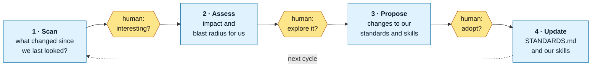

# ai-native-sdlc

How Okja builds software as an AI-native team — captured, kept current, and used on itself.

This repository does two things:

1. **States how mature AI-native teams work**, as of a date, with the evidence grade on every claim → [`STANDARDS.md`](STANDARDS.md)
2. **Keeps that statement true**, through a scheduled process that looks for what changed, brings findings to a human, and proposes changes to our own way of working → [`process/`](process/)

The second point is the one that matters. A standards document written once is wrong within a quarter. This repo is the loop that notices.

## The loop

Three human gates. Nothing advances a stage without a person deciding it should.

## What's here

| File | What it is | State |
|---|---|---|
| [`AGENTS.md`](AGENTS.md) | How to work here — commit and push conventions, enforced by `.githooks/` | built |
| [`intent.md`](intent.md) | Why this repository exists and what we believe | drafted |
| [`spec.md`](spec.md) | What V0 is, and what it is not yet | drafted |
| [`STANDARDS.md`](STANDARDS.md) | How mature AI-native teams work, as of Q3 2026 | drafted |
| [`process/01-scan/README.md`](process/01-scan/README.md) | Stage 1 — the scan, specified | specified |
| [`process/01-scan/findings-contract.md`](process/01-scan/findings-contract.md) | The shape of a findings file, declared once | built |
| [`process/01-scan/validate-findings.sh`](process/01-scan/validate-findings.sh) | The gate that refuses a findings file breaking that contract | built |
| [`process/01-scan/scan.md`](process/01-scan/scan.md) | How a cycle is run: three source agents, one merged file | built, as an instruction |
| [`process/01-scan/findings/`](process/01-scan/findings/) | One file per cycle. Currently a worked example only | built |
| [`tests/`](tests/) | `run-all.sh` over the suites, and the assertions they use | built |
| Stages 2–4 | Assess, propose, update | named only |

## Status

**V0.** Stage 1 records and stops: the shape of a findings file is declared, a gate refuses a file that breaks it, and the cycle itself is a written instruction a person runs. **Nothing is scheduled and nothing runs on its own.** Stages 2–4 are names.

The prototype this derives from is preserved on the `experiment/0.0.0` branch and will not be merged. It is reference: what we tried, and what an adversarial audit of it found.
