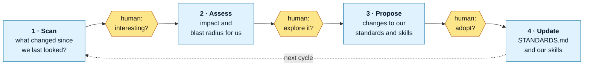

# ai-native-sdlc

How Okja builds software as an AI-native team — captured, kept current, and used on itself.

This repository does two things:

1. **States how mature AI-native teams work**, as of a date, with the evidence grade on every claim → [`STANDARDS.md`](STANDARDS.md)
2. **Keeps that statement true**, through a scheduled process that looks for what changed, brings findings to a human, and proposes changes to our own way of working → [`process/`](process/)

The second point is the one that matters. A standards document written once is wrong within a quarter. This repo is the loop that notices.

## The loop

Three human gates. Nothing advances a stage without a person deciding it should.

## What's here

| File | What it is | State |
|---|---|---|
| [`intent.md`](intent.md) | Why this repository exists and what we believe | drafted |
| [`spec.md`](spec.md) | What V0 is, and what it is not yet | drafted |
| [`STANDARDS.md`](STANDARDS.md) | How mature AI-native teams work, as of Q3 2026 | drafted |
| [`process/01-scan/`](process/01-scan/) | Stage 1 — the scan | specified, not built |
| Stages 2–4 | Assess, propose, update | named only |

## Status

**V0.** Nothing here is built yet — this is the intent, the spec, and the research it rests on. Stage 1 is specified so it can be argued with before it is written.

The prototype this derives from is preserved on the `experiment/0.0.0` branch and will not be merged. It is reference: what we tried, and what an adversarial audit of it found.
