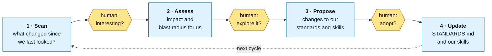

# ai-native-sdlc

How Okja builds software as an AI-native team — captured, kept current, and used on itself.

This repository does two things:

1. **States how mature AI-native teams work**, as of a date, with the evidence grade on every claim → [`STANDARDS.md`](STANDARDS.md)
2. **Keeps that statement true**, through a scheduled process that looks for what changed, brings findings to a human, and proposes changes to our own way of working → [`process/`](process/)

The second point is the one that matters. A standards document written once is wrong within a quarter. This repo is the loop that notices.

## The loop

```mermaid
flowchart LR
    S["<b>1 · Scan</b><br/>what changed since<br/>we last looked?"]
    G1{{"human:<br/>interesting?"}}
    A["<b>2 · Assess</b><br/>impact and<br/>blast radius for us"]
    G2{{"human:<br/>explore it?"}}
    P["<b>3 · Propose</b><br/>changes to our<br/>standards and skills"]
    G3{{"human:<br/>adopt?"}}
    U["<b>4 · Update</b><br/>STANDARDS.md<br/>and our skills"]

    S --> G1 --> A --> G2 --> P --> G3 --> U
    U -. "next cycle" .-> S

    classDef human fill:#fde68a,stroke:#b45309,color:#1c1917
    classDef step fill:#e0f2fe,stroke:#0369a1,color:#0c1a2b
    class G1,G2,G3 human
    class S,A,P,U step
```

Three human gates. Nothing advances a stage without a person deciding it should.

## What's here

| File | What it is | State |
|---|---|---|
| [`AGENTS.md`](AGENTS.md) | How to work here — conventions, enforced by `.githooks/` locally and by CI where they cannot be skipped | built |
| [`intent.md`](intent.md) | Why this repository exists and what we believe | drafted |
| [`spec.md`](spec.md) | What V0 is, and what it is not yet | drafted |
| [`STANDARDS.md`](STANDARDS.md) | How mature AI-native teams work, as of Q3 2026 | drafted |
| [`process/01-scan/README.md`](process/01-scan/README.md) | Stage 1 — the scan, specified | specified |
| [`process/01-scan/findings-contract.md`](process/01-scan/findings-contract.md) | The shape of a findings file, declared once | built |
| [`process/01-scan/validate-findings.sh`](process/01-scan/validate-findings.sh) | The gate that refuses a findings file breaking that contract | built |
| [`process/01-scan/scan.md`](process/01-scan/scan.md) | How a cycle is run: three source agents, one merged file | built, as an instruction |
| [`process/01-scan/findings/`](process/01-scan/findings/) | One file per cycle. `2026-09-29` is the first real one — 64 findings | built and run |
| [`process/02-discover/topics/`](process/02-discover/topics/) | Deep discovery on one question. First topic: classifier models | run once |
| [`process/02-discover/discovery-contract.md`](process/02-discover/discovery-contract.md) | The shape that artifact turned out to need — derived from it, not designed ahead | asserted, not enforced |
| [`tests/`](tests/) | `run-all.sh` over the suites, and the assertions they use | built |
| [`process/03-define/cycles/`](process/03-define/cycles/) | A cycle converged into themes. First: `2026-09-29`, 64 findings into 7 themes and 3 outliers | run once |
| [`process/03-define/define-contract.md`](process/03-define/define-contract.md) | The shape that artifact needed — derived from it, not designed ahead | **3 of 5 checks enforced** |
| [`process/04-develop/options/`](process/04-develop/options/) | A problem diverged into options, none chosen. First: producing themes | run once |
| [`process/04-develop/develop-contract.md`](process/04-develop/develop-contract.md) | The shape that artifact needed — derived from it, not designed ahead | asserted, not enforced |
| [`process/05-deliver/decisions/`](process/05-deliver/decisions/) | One choice, by a named person, with what is given up written down | **awaiting a human** |
| [`process/05-deliver/deliver-contract.md`](process/05-deliver/deliver-contract.md) | The shape a decision needs | **gated** — a decision needs a named human |
| [`process/05-deliver/validate-decision.sh`](process/05-deliver/validate-decision.sh) | Refuses a decision with no named person, no date, or an option that does not exist | built |
| [`process/03-define/validate-define.sh`](process/03-define/validate-define.sh) | Refuses a cycle that drops a finding, omits its method, or has no outlier section | built |
| [`bin/cycle.sh`](bin/cycle.sh) | Where every cycle is and what is missing. Reads the tree, writes nothing | built |
| [`bin/next.sh`](bin/next.sh) | Starts the next artifact, with the fields and sections read out of the contract that declares them. Refuses to overwrite | built |

## Status

**V0.** All five phases have been run once, on cycle `2026-09-29` — 64 findings, 7 themes, 3 outliers, 1 problem, 6 options, and a decision record **waiting on a person**. Three phases have gates. `bin/cycle.sh` says where a cycle is; `bin/next.sh` starts the artifact it needs next.

**Nothing is scheduled and nothing runs on its own.** A person starts every cycle, and a person writes every judgement — `next.sh` produces the skeleton, and the gates refuse that skeleton until it is filled in.

The prototype this derives from is preserved on the `experiment/0.0.0` branch and will not be merged. It is reference: what we tried, and what an adversarial audit of it found.
