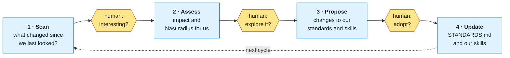

# ai-native-sdlc

How Okja builds software as an AI-native team — captured, kept current, and used on itself.

This repository does two things:

1. **States how mature AI-native teams work**, as of a date, with the evidence grade on every claim → [`STANDARDS.md`](STANDARDS.md)
2. **Keeps that statement true**, through a process that looks for what changed, brings findings to a human, and proposes changes to our own way of working → [`process/`](process/)

The second point is the one that matters. A standards document written once is wrong within a quarter. This repo is the loop that notices.

**The loop's subject is us.** It scans what is changing in how teams build software, converges the noise into something a person can read, and the thing that comes out the other end is a change to our own standards or our own tools. It is pointed at itself, which is the only reason it is worth running rather than reading.

Two examples of that, both real, both in the tree:

- **Inward.** A cycle produced 64 findings — more than anyone reads, which is a defect in the loop itself. That went through Define, Develop and Deliver and came out as a dated decision about how themes get produced, with a tripwire so that waiting could not quietly become the answer.
- **Outward, returning inward.** The scan caught a vendor shipping agent approval of pull requests. Define found that whether it collides with [`STANDARDS.md`](STANDARDS.md) §3 turns entirely on what the word *"separate"* is doing in our own sentence. An external capability went in; a question about our own writing came out.

## The loop


```mermaid
flowchart LR
    S["<b>1 · Scan</b><br/>what changed since<br/>we last looked?"]
    G1{{"human:<br/>interesting?"}}
    A["<b>2 · Assess</b><br/>impact and<br/>blast radius for us"]
    G2{{"human:<br/>explore it?"}}
    P["<b>3 · Propose</b><br/>changes to our<br/>standards and skills"]
    G3{{"human:<br/>adopt?"}}
    U["<b>4 · Update</b><br/>STANDARDS.md<br/>and our skills"]

    S --> G1 --> A --> G2 --> P --> G3 --> U
    U -. "next cycle" .-> S

    classDef human fill:#fde68a,stroke:#b45309,color:#1c1917
    classDef step fill:#e0f2fe,stroke:#0369a1,color:#0c1a2b
    class G1,G2,G3 human
    class S,A,P,U step
```

Three human gates. Nothing advances a stage without a person deciding it should.

## What's here

| File | What it is for |
|---|---|
| [`AGENTS.md`](AGENTS.md) | How to work here — conventions, enforced by `.githooks/` locally and by CI where they cannot be skipped |
| [`intent.md`](intent.md) | Why this repository exists and what we believe |
| [`spec.md`](spec.md) | What V0 is, and what it is not |
| [`STANDARDS.md`](STANDARDS.md) | How mature AI-native teams work, as of a date, graded |
| [`process/01-scan/`](process/01-scan/) | Record what changed. A contract, a gate that refuses a file breaking it, and the instruction a person runs |
| [`process/01-scan/findings/`](process/01-scan/findings/) | One findings file per cycle. Ranks nothing, drops nothing |
| [`process/02-discover/`](process/02-discover/) | Establish what is true about one question, every claim graded and sourced. Recommends nothing |
| [`process/03-define/`](process/03-define/) | Converge a cycle into themes, and a theme into a stated problem. A theme is a summary, not a filter |
| [`process/03-define/validate-define.sh`](process/03-define/validate-define.sh) | Refuses a cycle that drops a finding, omits its method, or has no outlier section |
| [`process/04-develop/`](process/04-develop/) | Diverge a problem into options, each with its cost and its failure mode. Chooses nothing |
| [`process/05-deliver/`](process/05-deliver/) | Converge on one choice, with the accepted cost and a reversal condition |
| [`process/05-deliver/validate-decision.sh`](process/05-deliver/validate-decision.sh) | Refuses a decision with no named person, no date, or an option that does not exist |
| [`bin/cycle.sh`](bin/cycle.sh) | Where every cycle is and what is missing. Reads the tree, writes nothing |
| [`bin/next.sh`](bin/next.sh) | Starts the next artifact, with its shape read from the contract that declares it. Refuses to overwrite |
| [`tests/`](tests/) | `run-all.sh` over the suites, and the assertions they use |

Each phase's contract was written **after** the artifact it describes, from what that artifact turned out to need — and is asserted rather than enforced until a second, differently shaped artifact shows which parts were real.

## Status

```bash
bin/cycle.sh
```

That is the status. It reads the tree, so it is correct by construction. Counts are deliberately not repeated here — a hand-typed copy of what a script already computes went stale three times in days, caught by a reader every time and by a check never.

**Nothing is scheduled and nothing runs on its own.** A person starts every cycle, and a person writes every judgement — `next.sh` produces the skeleton, and the gates refuse that skeleton until it is filled in.

The prototype this derives from is preserved on the `experiment/0.0.0` branch and will not be merged. It is reference: what we tried, and what an adversarial audit of it found.
