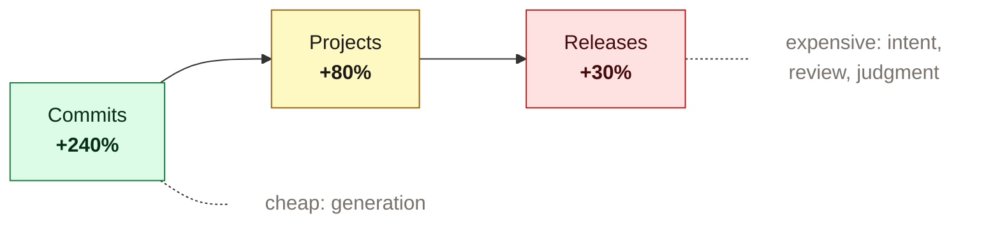
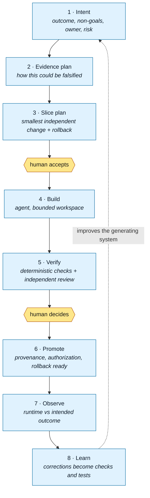
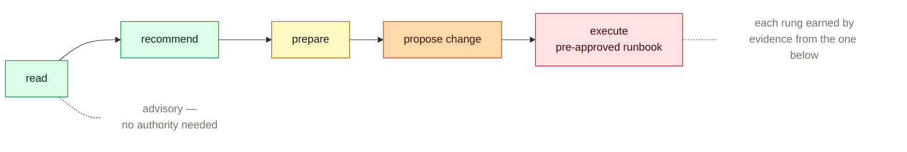

# How mature AI-native teams work

**As of Q3 2026 (2026-09-25).** This is a statement of current accepted practice, not a proposal. It is platform-agnostic: the practices below apply on any agentic coding platform, and where a claim comes from one vendor about their own tools, it is marked as such.

Every claim carries a grade. The grade is the point of this document — "accepted standard" and "one vendor's blog post" are not the same thing, and most published material on this subject right now is the second.

| Grade | Means |
|---|---|
| **[E]** | Empirical — controlled experiment or large-scale observational study |
| **[S]** | Standard — NIST, OWASP, SSDF, SLSA |
| **[V]** | Vendor methodology — a supplier describing their own practice. **Not outcome evidence.** |
| **[P]** | Practitioner consensus — widely held, not measured |
| **[O]** | Open — contested or unresolved |

---

## 1. The constraint moved. It is no longer generation.

**[E]** The largest study available — 500,000+ GitHub developers with usage telemetry — finds the gain attenuating sharply as work moves toward production.

Observational, not causal. But the direction is consistent with the second finding:

**[E]** Acceleration is **conditional, not general.** A peer-reviewed field experiment across 4,867 developers found ~26% more completed tasks — *run by Microsoft and Accenture on GitHub Copilot, with vendor co-authors*, so read it as a vendor-sponsored result. Against that, a controlled study of 16 experienced maintainers on 246 tasks in their own repositories found them **19% slower.** Clear bounded work with fast feedback tends to benefit; mature, tacit, high-assurance work can incur a verification tax larger than the generation gain.

> **[O] Recency caveat that must not be dropped:** METR **publicly superseded** their own slowdown figure on 2026-02-24, reporting late-2025 data consistent with a possible speedup. The 19% result stands for its period and was not retracted, but anyone citing it today owes the reader that update.

**[V]** Vendor self-reports of large internal multipliers exist and are uncontrolled, self-measured, and framed around speed. Use them as evidence that a verification bottleneck is *real* — several describe interventions that failed within days — not as evidence that any practice works.

**The practice that follows:** do not add generation capacity without adding specification, verification, and review capacity. **[P]**

---

## 2. The unit of work is a reviewable slice, moved through sequential gates

**[P]** with **[V]** corroboration on the stage mechanics. This is the core of how mature teams work: not one long autonomous run, but a chain of small artifacts, each of which a person can accept or reject before risk expands.

Three things distinguish this from a normal pipeline:

**The evidence plan comes before the build.** You state how the change could be proven wrong *before* implementing it. This is the single cheapest defence against a review that rationalizes whatever was built. **[P]**

**The slice is the smallest independently valuable change**, with its own rollback. **[P]** — and note **[O]**: no source establishes a maximum reviewable size. Nobody has measured this. It is a working hypothesis.

**Production is part of verification, not after it.** **[E]/[S]** Tests prove modeled expectations; production reveals actual behavior. Deployment identity, traces, and customer outcomes connect back to the originating intent.

---

## 3. An agent runs checks. It does not set them, and it cannot pass itself.

**[V]** stated plainly by vendors — *"the agent that wrote the code has no way to approve it"* — and **[E]** in the sense that this is the most reliably reproduced failure in practice. Agents asked to assess their own work praise it; a dedicated reviewer agent will talk itself out of its own findings.

**The practice:** separation of duties. Whoever produced the change does not grade it. A second, independent evaluator — human or a *separate* agent with no memory of building it — with criteria written down beforehand. This maps onto maker-checker, which is why it travels well in regulated environments. **[S]**

**[P]** Corollary: what an agent must **not** do is more useful to write down than what it should. A prose promise is not a control — if a boundary matters, something has to refuse.

---

## 4. Autonomy is earned per action class, never granted globally

**[S]/[P]** Prompts and skills are advisory. Consequence-bearing authority requires identity, least privilege, least agency, sandboxing, policy enforcement, provenance, observable operations, and tested rollback.

A rung is earned by accumulated evidence at the rung below, for that specific action class. **[O]** Which actions can safely advance, and on how much evidence, is unresolved — nobody has published a defensible threshold.

---

## 5. Determinism first, and it must be earned by observation

**[P]** If an invariant can be proven by a script, type, test, policy, or protected gate, do not delegate it to model judgment. Model review is useful and probabilistic; deterministic checks and accountable human judgment absorb the volume.

**[O]** How much to harness is genuinely unsettled. Vendor guidance explicitly warns *against* harnessing tasks already inside baseline model capability, and recommends grading the artifact produced rather than the path taken — pinned step sequences are brittle. Every deterministic component encodes an assumption about what a model cannot do, and those assumptions expire as models change, so each one needs a re-test obligation.

Our own prior attempt allocated a fixed deterministic ratio in advance. That turned out to be unfalsifiable — no unit, no denominator, no threshold — and is recorded here as a mistake rather than a practice.

---

## 6. Measure outcomes, not activity

**[E]** The delivery-research consensus is that activity metrics mislead and that AI amplifies existing platform quality, architecture, and organizational health rather than substituting for them.

**Worth measuring:** defects escaping to production versus caught before merge · repeat incidents of the same class · rework after human approval · intent survival — intents accepted versus closed unbuilt · change failure and recovery time · human review time and intervention rate · comprehension and confidence calibration.

**[O] An honest disagreement in our own material.** Our research names a candidate north star of *"cost and lead time per production-qualified value slice."* That is partly a cycle-time measure, and cycle-time measures cannot distinguish better software from faster software. Unresolved — flagged rather than quietly dropped.

---

## 7. Learning has to improve the generating system

**[P]** A repeated correction should become a stronger check, a regression test, scoped context, or a focused skill. Capturing everything into always-on context recreates the cognitive overload the system exists to reduce. Promote rarely; prefer a test over a paragraph; delete what goes stale.

---

## What is genuinely unresolved

Not gaps in this document — open questions in the field, as of Q3 2026.

1. How to measure cognitive reviewability without making lines-changed a target.
2. What evidence minimum belongs to each risk tier.
3. When a product intent needs decomposing before it enters the workflow.
4. How much reviewer diversity produces real independence.
5. Which agent actions can safely advance a rung, on what evidence.
6. How to measure comprehension and skill atrophy over time.
7. Which production outcomes count as validated learning at low customer volume.
8. Whether intent scopes to a change, or whether a monorepo also needs standing intent per module — a promise the module makes that outlives any one change to it.

---

## Provenance and maintenance

Derived from research conducted Q3 2026, preserved with its source register on `experiment/0.0.0`. **Known defects in that corpus, being corrected rather than inherited:** one source's population understated fivefold; the METR supersession above unrecorded; three vendor-affiliated sources filed under non-vendor labels.

This document is expected to go stale. It carries a date because the honest version of "current standards" is a dated snapshot with a refresh obligation, not a permanent claim. **Review cadence: monthly** — what changed, what was superseded, what is newly contested.

*No claim here asserts that following these practices makes a team faster. That claim is not supported by anything cited above, and this repository does not make it.*
