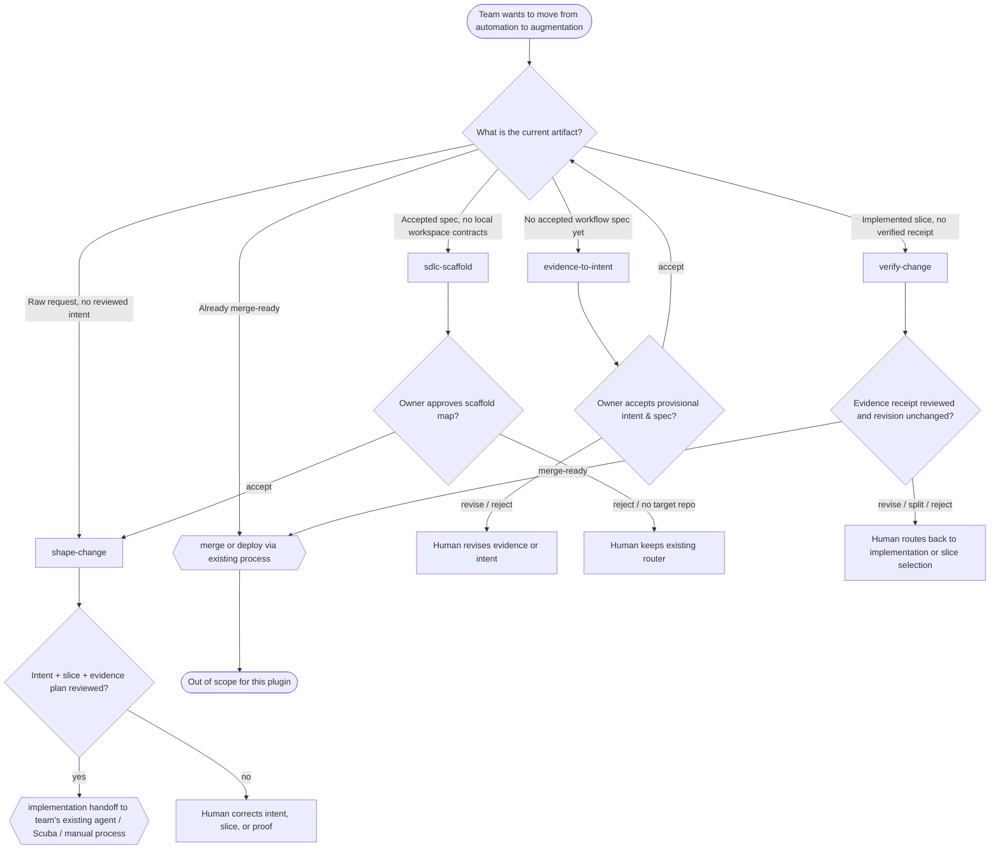

# Skill decision tree: research-derived skill ecosystem for AI-native SDLC

## Purpose

Route a team from its current artifact to the smallest skill or human checkpoint that preserves sequential HITL control. This tree is the research-level counterpart to the workflow specification: it turns the recommended Option C skill system into an ICM-style stage router.

The tree is intentionally narrow. It covers only the intent-to-merge-ready boundary the research recommends for the first pilot. Everything outside that boundary is explicitly deferred.

## How to read the tree

- **Diamonds** are human or artifact state questions.
- **Rectangles** are skills or checkpoints.
- **Ovals** are terminal states or out-of-scope handoffs.
- A skill is invoked only when its trigger condition is true; otherwise the path routes to a human decision or an out-of-scope note.

## Decision rules by node

### START: Team wants to move from automation to augmentation

The research conclusion is that AI-native teams gain sustainable throughput only when generation speed is matched by faster, more explicit human decisions. The goal is not to add more automation; it is to make each human decision cheaper and more reversible.

### Q1: What is the current artifact?

| Current state | Next action | Rationale |
|---|---|---|
| No accepted workflow specification, or mixed evidence needing synthesis | `evidence-to-intent` | The research phase is not complete until intent can be grounded in evaluated evidence (RESEARCH.md §Implication for the future plugin). |
| Accepted spec, target repository selected, no local contracts | `sdlc-scaffold` | Only add workspace scaffolding when existing routers cannot already carry the required human checks (skill-system-options.md §Option C). |
| Raw request, no reviewed intent, slice, or evidence plan | `shape-change` | This is the core leverage point: define the smallest reviewable value slice before implementation. |
| Implemented slice, upstream artifacts reviewed, no verified receipt | `verify-change` | The second leverage point: reconcile changed surface with accepted intent and evidence before merge. |
| Already merge-ready | Existing merge/deploy process | The plugin never authorizes merge or deployment. |

### Q2: Owner accepts provisional intent and specification?

`evidence-to-intent` produces a provisional specification and stops. The owner must explicitly accept, revise, or reject. Acceptance authorizes later design only; `implementation_authorized` remains false.

### Q3: Owner approves scaffold map?

`sdlc-scaffold` inspects the target repository and proposes the smallest useful form: a saved prompt, a route amendment, or a folder scaffold. Default to no scaffold when existing files suffice.

### Q4: Intent, slice, and evidence plan reviewed?

`shape-change` sequences three human checkpoints:

1. **Intent** — request owner accepts the problem, outcome, constraints, and non-goals.
2. **Slice** — accountable engineer selects the reviewable value slice.
3. **Evidence plan** — accountable engineer accepts how an incorrect implementation would be falsified.

Only when all three are reviewed does the skill emit an implementation handoff.

### Q5: Evidence receipt reviewed and revision unchanged?

`verify-change` pins the current revision, runs the evidence plan, and stops for a merge-readiness decision. Any revision change after review reopens verification.

## Skill profiles

### `evidence-to-intent` — installable research slice (exists)

| Field | Value |
|---|---|
| Trigger | The team has evaluated evidence but no accepted intent/specification. |
| Inputs | Owner record, selected research cards, acceptance cues, explicit input/output roots. |
| Outputs | `OUTPUT_ROOT/RUN_ID/intent-specification.md` or a gap report. |
| Human check | Owner accepts, revises, or rejects the provisional specification. |
| Out of scope | Implementation, merge, deployment, RLP promotion, Skill Architect. |
| Status | Installed in `skills/`, static validators passing, live evaluation pending per roadmap. |

### `sdlc-scaffold`

| Field | Value |
|---|---|
| Trigger | The workflow specification is accepted and a target repository has been selected, but the repository lacks local contracts to preserve intent/slice/evidence/merge decisions. |
| Inputs | Accepted workflow specification, target repository's existing routers, owner decision on smallest useful form. |
| Outputs | Proposed create/modify/unchanged map; no target-repo files during research. |
| Human check | Repository owner confirms each proposed file has one job and fits existing conventions. |
| Out of scope | Implementation, replacing existing routers, scaffolding the full lifecycle when a smaller form works. |
| Status | Promoted to `skills/`; installable once scripts and validators are added. |

### `shape-change`

| Field | Value |
|---|---|
| Trigger | A raw software request exists and the problem boundaries or proof are not already explicit. |
| Inputs | Raw request in owner's words, repository rules, named request owner and accountable engineer. |
| Outputs | Accepted intent, selected reviewable value slice, approved evidence plan, implementation handoff. |
| Human check | Request owner owns intent; accountable engineer owns slice and proof. Missing value, hidden dependencies, or unfalsifiable acceptance blocks handoff. |
| Out of scope | Writing code, turning research into owner facts, creating RLP or Skill Architect artifacts. |
| Status | Promoted to `skills/`; installable once scripts and validators are added. |

### `verify-change`

| Field | Value |
|---|---|
| Trigger | A slice has been implemented and upstream artifacts are reviewed. |
| Inputs | Reviewed intent/slice/evidence plan, current changed surface, current revision, repository verification commands. |
| Outputs | Revision-pinned evidence receipt; merge-ready/revise/split/reject decision pending human merge authority. |
| Human check | Independent reviewer accepts the receipt; merge authority owns the terminal decision. |
| Out of scope | Merging, deploying, inferring execution from summaries, accepting evidence from a different revision. |
| Status | Promoted to `skills/`; installable once scripts and validators are added. |

## ICM stage mapping

The skills above are not arbitrary commands; they correspond to the ICM layers in this repository:

| ICM layer | File / folder | Role in this skill ecosystem |
|---|---|---|
| L0 | `CLAUDE.md` | Always load; contains the routing table that sends a task to this decision tree. |
| L1 | `CONTEXT.md` | Route the user's current state to the correct skill or stage contract. |
| L2 | `research/stages/*/CONTEXT.md` | Research stages (discover, evaluate, synthesize, frame pilot) produce the evaluated claims that feed `evidence-to-intent`. |
| L3 | `shared/`, `_config/`, `references/` | Stable contracts: flow unit, evidence schema, workflow specification, skill-system options, skill reference contracts. |
| L4 | `research/stages/*/output/` | Research outputs and per-run skill outputs (e.g., `intent-specification.md`, `changes/{slice-id}/`). |

Each skill follows the same ICM discipline: load only the named references, produce one artifact per run, and hand off only through `output/`.

## Research basis

This tree directly implements the conclusions in:

- [`RESEARCH.md`](../../../../RESEARCH.md) — augmentation before automation, sequential HITL gates, least agency, production closes the loop.
- [`PRINCIPLES.md`](../../../../PRINCIPLES.md) — 60/30/10 allocation, value is the flow unit, learning is filtered.
- [`skill-system-options.md`](skill-system-options.md) — Option C recommended; Options A, B, D rejected or deferred.
- [`workflow-specification.md`](workflow-specification.md) — phase contracts A–F and terminal merge-readiness decision.

## Skill-audit structural summary

All four skills passed the deterministic structural checks from the local `skill-audit` skill:

| Skill | Frontmatter | Structure | Notes |
|---|---|---|---|
| `evidence-to-intent` | pass | pass | Has `scripts/` and `references/`; no `assets/`. |
| `sdlc-scaffold` | pass | pass | No `scripts/`, no `assets/`; references present. |
| `shape-change` | pass | pass | No `scripts/`, no `assets/`; references present. |
| `verify-change` | pass | pass | No `scripts/`, no `assets/`; references present. |

What the structural checks do not cover (and would need review before installation):

- Whether the descriptions trigger reliably in the target host.
- Whether the 60/30/10 ratio in each skill body matches the research heuristic.
- Whether each skill has enough concrete examples and pass/fail criteria for a new user.
- Whether the research-draft skills need bundled validators before promotion to `skills/`.

## Out-of-scope and deferred boundaries

The following are deliberately not skills in this ecosystem:

| Capability | Why it is excluded | Where it belongs |
|---|---|---|
| Autonomous implementation orchestration | Removes the accountable engineer from slice/plan decisions. | The team's existing coding agent or Scuba workflow. |
| Merge, deploy, promote | Consequence-bearing authority must stay with existing human/process gates. | Repository/CI/merge policy, not this plugin. |
| RLP capture or promotion | Learning must be filtered by a separate human review ritual. | RLP plugin or process. |
| Skill Architect auditing | A candidate skill must be audited before release, but that audit is not part of the SDLC workflow. | `skill-audit` skill, invoked separately. |
| Production observation and validated learning | Closes the loop, but requires telemetry and customer-outcome infrastructure the pilot may not have. | Later workflow extension or separate observability system. |

## Pilot use guidance

For the first pilot with an AI-native team:

1. Start with `evidence-to-intent` if the team has not yet accepted the workflow specification.
2. Once the spec is accepted, evaluate whether the target repository already has routers that can carry the required checkpoints. If yes, skip `sdlc-scaffold`.
3. Run `shape-change` on one real, bounded request. Do not let it proceed to implementation until intent, slice, and evidence plan are reviewed.
4. Let the team's existing agent or process implement the approved slice.
5. Run `verify-change` before any merge discussion. Record the merge-readiness decision explicitly.
6. Measure intent-to-merge lead time, review time, rework rate, and reviewer confidence.
7. Do not add more skills until the pilot shows that one of these three is overloaded or repeatedly triggered independently.

## Acceptance condition

This decision tree is accepted when the owner recognizes the routing logic, agrees that the three Option C skills are the right starting set, and confirms that the out-of-scope boundaries match the team's authority structure. Acceptance authorizes refining the research-draft skill contracts only; it does not authorize installing them as public skills.
