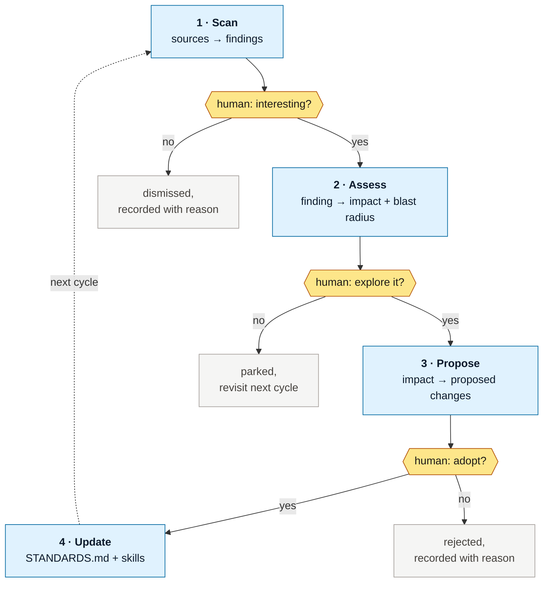

# Spec — V0

**Status:** draft, unaccepted. Nothing downstream of this is authorized.

Derived from [`intent.md`](intent.md). Scoped deliberately small: V0 states the intent, captures the research, and specifies **stage 1 only** — so the stage can be argued with before it is written.

## What V0 is

Four documents and one stage specification. No code.

| Deliverable | State after V0 |
|---|---|
| `intent.md` — why this exists, what we believe, how sure we are | written |
| `STANDARDS.md` — how mature AI-native teams work, Q3 2026, graded | written |
| `spec.md` — this document | written |
| `README.md` — the loop, and what's here | written |
| `process/01-scan/` — the scan stage, specified | specified, **not built** |

## What V0 is not

Stages 2–4 (assess, propose, update) are **named only.** No classifier. No tooling — no CLI, no MCP server, no skills. No scheduled job. Nothing runs.

This is on purpose. Stage 1's output shape determines everything downstream, and the cheapest time to get it wrong is now.

## The architect loop

Four stages, three human gates. A stage produces one artifact and stops.

**A dismissal is an outcome, not an absence.** "Not interesting" gets recorded with its reason, because next cycle we need to know we already looked — and because a classifier that suppresses something important is only discoverable if its decisions are written down.

## Stage 1 — the scan

Specified in [`process/01-scan/README.md`](process/01-scan/README.md). In summary:

**Asks:** since we last looked, what has come out about how AI-native teams build software? Releases, milestones, notable events, and — the part that matters most — *how people are actually changing their way of working in response.*

**Sources:** the web, X, YouTube. A release note tells you a capability shipped; a thread or a talk tells you whether anyone changed how they work because of it. The second is the signal.

**Produces:** a findings file per cycle. Each finding carries what it is, where it came from, when, what it might affect, and an initial consequence guess — nothing more. **Stage 1 does not assess impact.** That is stage 2, behind a human gate.

**Stops at:** a human reading the findings. Stage 1 has no authority to advance anything.

## Cadence

Start **monthly**, on the first. Monthly output is readable without a classifier, which means the first few cycles tell us the real signal rate before we build one.

Move to weekly or daily only when a classifier exists and has been wrong in front of us at least once, so we know how it fails. Cadence is cheap; attention is not.

## What has to be true for V0 to be accepted

1. A person reads `STANDARDS.md` and can tell which claims are established and which are ours.
2. A person reads the stage 1 spec and can say "that would find something useful" — or say precisely why not.
3. Nothing in this repository claims a capability it does not have.
4. No claim about speed, throughput or velocity appears anywhere.

## Open, to settle before stage 1 is built

- **Source list and tool naming.** One tool came up in discussion and its name did not transcribe cleanly. Names going into a standards document need to be right, so the source list is unsettled.
- **What "since we last looked" is anchored to** — a stored date, or the last findings file in the repo. The second is self-describing and needs no state outside git.
- **Whether a finding is one file or one row.** Per-finding files diff well and are addressable; a single table per cycle reads faster. Leaning per-cycle file containing rows, and revisiting when volume says otherwise.
- **Whether stage 1 may use paid search or fetch at all**, and what that costs per cycle.
