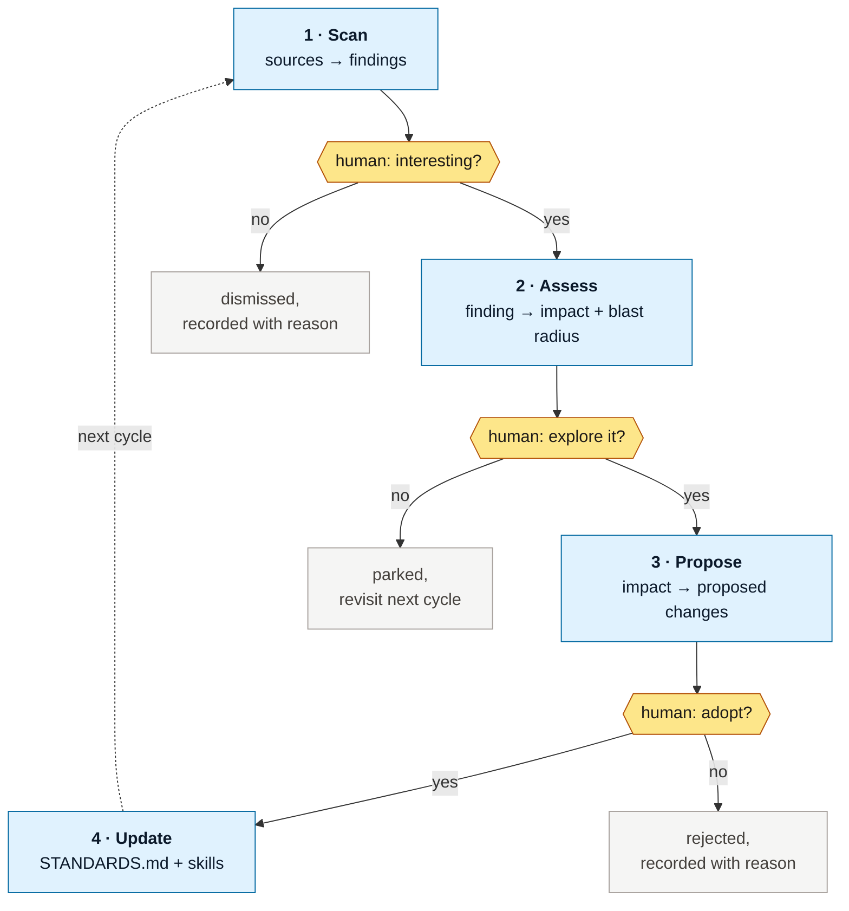

# Spec — V0

**Status:** draft, unaccepted. Nothing downstream of this is authorized.

Derived from [`intent.md`](intent.md). Scoped deliberately small: V0 states the intent, captures the research, and specifies **stage 1 only** — so the stage can be argued with before it is written.

## What V0 is

Four documents and one stage specification. No code.

| Deliverable | State after V0 |
|---|---|
| `intent.md` — why this exists, what we believe, how sure we are | written |
| `STANDARDS.md` — how mature AI-native teams work, Q3 2026, graded | written |
| `spec.md` — this document | written |
| `README.md` — the loop, and what's here | written |
| `process/01-scan/` — the scan stage | **built and run** — contract, gate, instruction, one real cycle |
| `process/02-discover/` — topic discovery | **run once**, contract derived from it, no gate |
| `process/03-define/` — converge a cycle into themes | **run once**, contract derived from it, no gate |

## What V0 is not

There is still no classifier, no CLI, no MCP server, and no scheduled job. Nothing runs on its own; a person starts every cycle.

**Stage 1 is built and has been run.** Cycle `2026-09-29` produced 64 findings across three sources, and the gate refused the first draft before accepting it. Discovery has been run once, on the classifier question, and `process/02-discover/discovery-contract.md` describes the shape that artifact turned out to need — **derived from it rather than designed ahead of it, and asserted rather than enforced**, because one artifact is not enough to know which parts are real.

**Define has been run once**, converging cycle `2026-09-29`'s 64 findings into seven themes and three outliers, with every finding accounted for. **Develop and Deliver do not exist**, so there is still nowhere to record the human's per-theme decision.

> **This section has gone stale twice within days of shipping.** It said "specified, not built" after the stage was built, then "a scan has not been run" after one had. Both were caught only because someone read it. Worth naming rather than quietly fixing a third time: a document stating the state of the work is wrong by default the moment the work moves, and nothing here checks it.

This is on purpose. Stage 1's output shape determines everything downstream, and the cheapest time to get it wrong is now.

## The architect loop

Four stages, three human gates. A stage produces one artifact and stops.

```mermaid
flowchart TD
    S["<b>1 · Scan</b><br/>sources → findings"]
    G1{{"human: interesting?"}}
    A["<b>2 · Assess</b><br/>finding → impact + blast radius"]
    G2{{"human: explore it?"}}
    P["<b>3 · Propose</b><br/>impact → proposed changes"]
    G3{{"human: adopt?"}}
    U["<b>4 · Update</b><br/>STANDARDS.md + skills"]

    S --> G1
    G1 -->|"yes"| A
    G1 -->|"no"| X1["dismissed,<br/>recorded with reason"]:::drop
    G2 -->|"yes"| P
    G2 -->|"no"| X2["parked,<br/>revisit next cycle"]:::drop
    A --> G2
    P --> G3
    G3 -->|"yes"| U
    G3 -->|"no"| X3["rejected,<br/>recorded with reason"]:::drop
    U -. "next cycle" .-> S

    classDef human fill:#fde68a,stroke:#b45309,color:#1c1917
    classDef step fill:#e0f2fe,stroke:#0369a1,color:#0c1a2b
    classDef drop fill:#f5f5f4,stroke:#a8a29e,color:#44403c
    class G1,G2,G3 human
    class S,A,P,U step
```

**A dismissal is an outcome, not an absence.** "Not interesting" gets recorded with its reason, because next cycle we need to know we already looked — and because a classifier that suppresses something important is only discoverable if its decisions are written down.

## Stage 1 — the scan

Specified in [`process/01-scan/README.md`](process/01-scan/README.md). In summary:

**Asks:** since we last looked, what has come out about how AI-native teams build software? Releases, milestones, notable events, and — the part that matters most — *how people are actually changing their way of working in response.*

**Sources:** the web, X, YouTube. A release note tells you a capability shipped; a thread or a talk tells you whether anyone changed how they work because of it. The second is the signal.

**Produces:** a findings file per cycle. Each finding carries what it is, where it came from, when, what it might affect, and an initial consequence guess — nothing more. **Stage 1 does not assess impact.** That is stage 2, behind a human gate.

**Stops at:** a human reading the findings. Stage 1 has no authority to advance anything.

## Cadence

Start **monthly**, on the first. Monthly output is readable without a classifier, which means the first few cycles tell us the real signal rate before we build one.

Move to weekly or daily only when a classifier exists and has been wrong in front of us at least once, so we know how it fails. Cadence is cheap; attention is not.

## What has to be true for V0 to be accepted

1. A person reads `STANDARDS.md` and can tell which claims are established and which are ours.
2. A person reads the stage 1 spec and can say "that would find something useful" — or say precisely why not.
3. Nothing in this repository claims a capability it does not have.
4. No claim about speed, throughput or velocity appears anywhere.

## Open, to settle before stage 1 is built

- **Whether three sources are the right three**, and whether paid search or fetch is in scope. Cycle 2026-09-29 reached X only through unauthenticated surfaces.
- **What "since we last looked" is anchored to** — a stored date, or the last findings file in the repo. The second is self-describing and needs no state outside git.
- **Whether a finding is one file or one row.** Per-finding files diff well and are addressable; a single table per cycle reads faster. Leaning per-cycle file containing rows, and revisiting when volume says otherwise.
- **Whether stage 1 may use paid search or fetch at all**, and what that costs per cycle.
